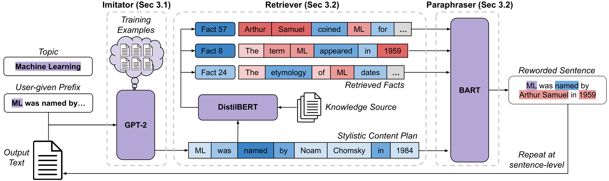

# Expository Text Generation

This repository is the official implementation of "Expository Text Generation: Imitate, Retrieve, Paraphrase", which was accepted to EMNLP 2023



## Overview

This code contains the Imitate, Retrieve, Paraphrase (IRP) framework for expository document generation. The framework leverages a set of topic-related factual sentences and a user-specified prefix in order to generate an expository document.

## Data

Before proceeding, please unzip the accompanying datasets in the `data/dataset` folder. The first step is to create the `web_sentences_with_desc` and `web_sentences_no_desc` columns of the dataset, which can be done by retrieving information from the web. We provide a script to do so in the `data` folder, using the following command:

```
python scrape_web.py
```

Additionally, before training the Paraphraser, a custom dataset must be created. You can create this dataset by running the following command:

```
python collect_paraphrase_data.py
```

Before this script can run, the Retriever must be trained, with instructions on how to do this detailed below in the "usage" section. The following parameters must be specified at the top of the `collect_paraphrase_data.py` file:

- `bert_name`: name of the Retriever model
- `dataset_name`: name of the dataset
- `input_column_name`: which column of the dataset to use as input
- `final_name`: the name of the dataset to save as
- `hf_token`: the huggingface API token

## Setup

Python 3.8.10 and pip 20.0.2 were used when running the code in this repository. A list of requirements can be found in `requirements.txt`, which can be installed through the following command:
```
pip install -r requirements.txt 
```

The most important files in this repository are as follows:
* `/data/`: contains the code to create the dataset for the Paraphraser
* `/eval/`: contains the code to calculate the metrics in the paper
* `/model/`: contains the implementation of IRP after all modules have been trained
* `/train/`: contains the code needed to train each module of IRP

## Usage

### Training

After navigating to `/train/`, run the following commands to train the Imitator, Retriever, and Paraphraser:

```
python train_imitator.py
```

```
python train_retriever.py
```

```
python train_paraphraser.py
```

We also provide a script to train the entailment model used during evaluation:

```
python train_nli.py
```

Each file has parameters to be specified at the top of the file, namely:
- `ds_name`: name of the dataset
- `final_name`: output directory and model name for the imitator
- `hf_token`: huggingface token to load the model (if saved online)

### Predictions

After navigating to `/model/`, simply run the following command:

```
python IRP.py
```
Parameters at the top of the file must be specified, namely:
- `ds_key`: expository document dataset to use. options are 'college', 'medicine', or 'wikipedia'
- `use_ds_with_doc`: boolean variable for whether or not to use the 'with doc' dataset
- `output_dir`: output directory
- `k`: number of facts for Retriever to select
- `temperature`: Imitator temperature

You must also fill in the dictionary `model_map` with the names of the trained Imitator, Retriever, and Paraphraser.

### Evaluation

We also provide a script for the calculations for Traditional Metrics, Entailment, and Contradictions. FactCC can be calculated by following the instructions [here](https://github.com/salesforce/factCC).

First, navigate to `/eval/`. You can run the following command to calculate the traditional metrics and hallucinations for IRP, LED, and RAG:

```
python traditional_metrics_halluc.py
```

The parameter to be specified at the top of this file is `results_pref`, which should be equal to the folder in `/eval/` that you would like to evaluate. Each folder in `eval` is named after a dataset, and is filled with `.pkl` files which contain the outputs for IRP, LED, and RAG.

To calculate entailment and contradictions, run the following command:

```
python nli.py
```

In addition to `results_pref`, at the top of the file you must specify the name of the entailment classifier (`entailment_model`). We provide a training script for this classifier in `/train/train_nli.py`
